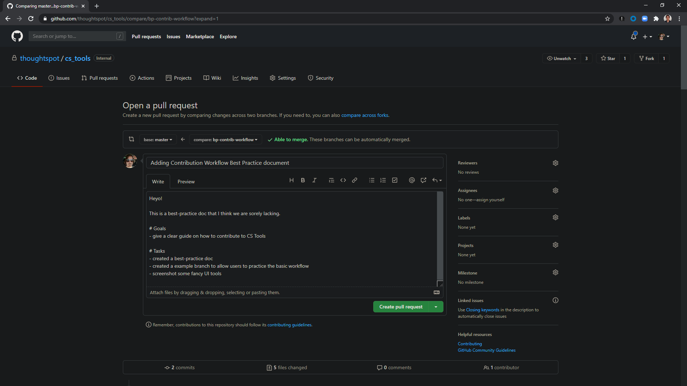
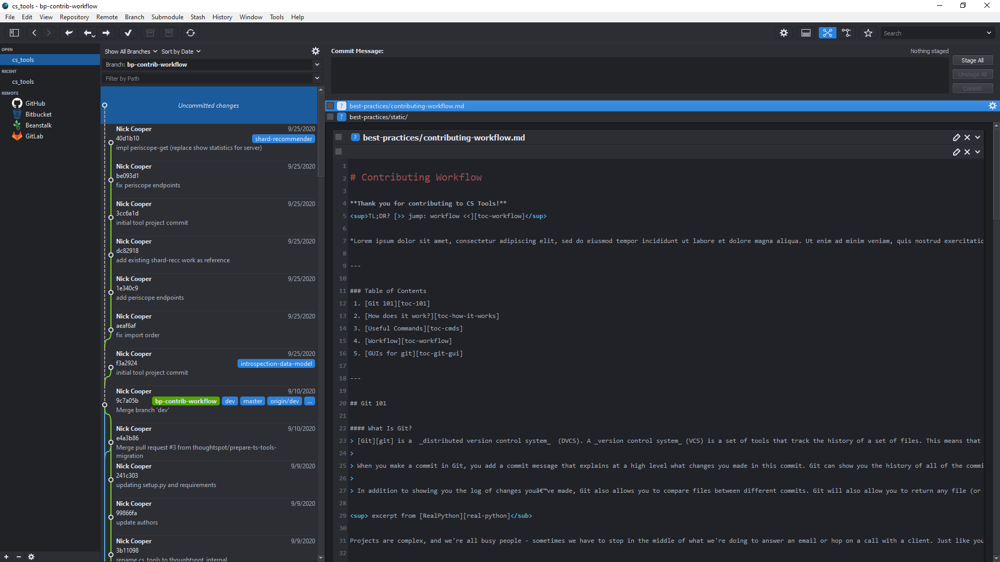

# Contributing Workflow

**Thank you for contributing to CS Tools!**

<sup>TL;DR? [>> jump: workflow <<][toc-workflow]</sup>

Want to help out the CS Tools project, but don't know how to get started? This Best Practices doc should help you get up and running with a copy of the project as well as arm you with the basics of how to contribute changes. No change is too small, so don't be discouraged even if you just see a typo and want to help make us sound like actual professionals. 😉

Don't forget to put your newfound skills into action with the [example section][workable-example]!

---

### Table of Contents
 1. [Git 101][toc-101]
 2. [How does it work?][toc-how-it-works]
 3. [Useful Commands][toc-cmds]
 4. [Workflow][toc-workflow]
 5. [GUIs for git][toc-git-gui]

---

## Git 101

#### What is Git?
> [Git][git] is a  _distributed version control system_  (DVCS). A _version control system_ (VCS) is a set of tools that track the history of a set of files. This means that you can tell your VCS to save the state of your files at any point. Then, you may continue to edit the files and store that state as well. Saving the state is similar to creating a backup copy of your working directory. When using Git, we refer to this saving of state as  _making a commit_.
>
> When you make a commit in Git, you add a commit message that explains at a high level what changes you made in this commit. Git can show you the history of all of the commits and their commit messages. This provides a useful history of what work you have done and can really help pinpoint when a bug crept into the system.
>
> In addition to showing you the log of changes you’ve made, Git also allows you to compare files between different commits. Git will also allow you to return any file (or all files) to an earlier commit with little effort.

<sup>excerpt from [RealPython][real-python]</sub>

Projects are complex, and we're all busy people - sometimes we have to stop in the middle of what we're doing to answer an email or hop on a call with a client. Just like you used to do in Microsoft Excel, saving your place after every significant change in your document is an important task. Sometimes you want to copy the workbook and make a version to try out a different pivot or view of the data.

This is exactly what we use git for, but with code!

#### What's the difference between Git and GitHub?
Git is a version control system; think of it as a series of snapshots (commits) of your code. You see a path of these snapshots, and in what order they where created. You can make branches to experiment and come back to snapshots you took.

GitHub, is a web-page on which you can publish your Git repositories and collaborate with other people.

<sub>[>> back to top <<][back-to-top]</sub>

## How does it work?

Git has three distinct areas where it holds data about a project. First, let's get some definitions out of the way.

**Remote Repository**: this is a place like GitHub. A centralized copy of the project which holds all the current-state information of the files in your project as well as the history of those files since the repo was initialized.

**Local Repository**: this is your personal machine - it's your copy of the remote repository. You do all your work here and git will track to see the differences between your copy of the repo and the remote copy of the repo.

**Staging Area**: when you get to a savepoint in your work, you'll need to tell git to add and commit your changes to your recorded copy of the project. Since git is quietly recording the differences between your local copy and the remote one, there's a neat thing available to you in that you can choose to bundle up a subset of your changes into a single savepoint.

<p align="center">
  
</p>

### Wait, what's a branch?
Great question! This is like making a copy of your Excel workbook, but also remember that git acts as a history of your files too. You can actually point your branch to a specific commit - meaning you're not limited to making a copy of the latest version of the project.

<sub>[>> back to top <<][back-to-top]</sub>

## Useful Commands
`git clone` - copy another repository located onto the local machine. Typically this the first command you run when working with a new repository.

`git pull` - grab all the changes from remote repository and merge them into your local repository

`git checkout <branch>` - switch to the copy of the repository named \<branch\>

`git branch <branch-name> dev` - make a copy of the dev branch, and call your new copy <\branch-name\>

`git add` - stage all the changes you've made for the next commit

`git commit -m "some message"` - commit the staged snapshot with the associated messaged

`git push` - push the current local copy of your branch to the remote copy

<sub>[>> back to top <<][back-to-top]</sub>

## Contributions Workflow

<p align="center">
  
</p>

 0. Clone the repository to your machine.
```
git clone ...
```
 1. Update your local copy of CS Tools.
```
git pull
```
 2. Checkout your branch and begin working
<sub>If your branch doesn't exist yet, use `git checkout -b <my-branch-name> dev`!</sub>
```
git checkout <my-branch-name>
<do some work>
```
3. Save your work often! When you've reached a logical conclusion in your work, commit those changes.
```
git add *
git commit -m "<commit msg>"
```
 4. Done for the day? Push your local changes up to the remote repository.
```
git push
```
 5. Once you've finalized your work on the branch, [open a pull request][cs-tools-pr].

<p align="center">
  
</p>

---

### Putting it all together, the workflow looks something like this.
<sub>** this works only on OSX/Linux</sub>
```
git clone https://github.com/thoughtspot/cs_tools.git
cd cs_tools/
git pull
git checkout bp-example-contributions

# just creating a cute variable for the workflow, don't mind me!
export _GIT_CSTOOLS_USER_NAME=$(if [[ $(git config user.name | head -c1 | wc -c) -ne 0 ]]; then echo $(git config user.name); else echo $USER; fi)

# simulate some work being done...
echo "Hello, world! - $_GIT_CSTOOLS_USER_NAME" >> ./best-practices/static/workflow_contributors.csv

git add *
git commit -m "$_GIT_CSTOOLS_USER_NAME ran the example workflow"
git push
```
<sub>[>> back to top <<][back-to-top]</sub>

## GUIs for git

Now that you know the basics, there are some application-based tools out there to make things easier in managing git-based projects.

### [GitAhead][git-gui-recc-gitahead]
> **GitAhead** is a graphical Git client for Windows, Linux and macOS. It features a fast native interface designed to help you understand and manage your source code history.
> 
> Git provides a wealth of historical information that, too often, goes unexploited because it's cumbersome to explore with other tools. We believe that when you understand your history you'll make better choices today!

<p align="center">
  
</p>

### [ungit][git-gui-recc-ungit]
> The easiest way to use git. On any platform. Anywhere.
> Ungit brings user friendliness to git without sacrificing the versatility of git.
>
> -   Clean and intuitive UI that makes it easy to  _understand_  git.
> -   Runs on any platform that node.js & git supports.
> -   Web-based, meaning you can run it on your cloud/pure shell machine and use the ui from your browser (just browse to  [http://your-cloud-machine.com:8448](http://your-cloud-machine.com:8448/)).

<p align="center">
  
</p>

<sub>[>> back to top <<][back-to-top]</sub>

[toc-101]: #git-101
[toc-how-it-works]: #how-does-it-work
[toc-cmds]: #useful-commands
[toc-git-gui]: #guis-for-git
[toc-workflow]: #contributions-workflow
[back-to-top]: #contributing-workflow
[workable-example]: #putting-it-all-together-the-workflow-looks-something-like-this
[cs-tools-pr]: https://github.com/thoughtspot/cs_tools/compare
[real-python]: https://realpython.com/python-git-github-intro/#what-is-git
[git]: https://git-scm.com/
[git-gui-recc-ungit]: https://github.com/FredrikNoren/ungit/releases/tag/v1.5.11
[git-gui-recc-gitahead]: https://gitahead.github.io/gitahead.com/
