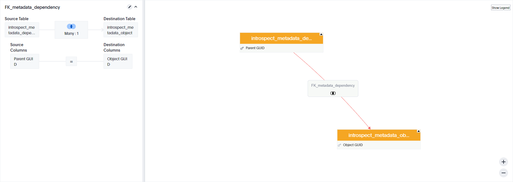

# Dependency Checker

***This tool utilizes private API calls.***

This solution allows the customer to Search all metadata that could produce a dependent.
These metadata types include System Tables, Imported Data, Worksheets, and Views.

This solution can be highly useful when planning out a Falcon to Embrace migration, when
re-designing a data model for a Worksheet, or just for keeping tabs on what types of
content a User makes.

## Relationship preview

<p align="center">
  
</p>

## CLI preview

```console
(.cs_tools) C:\work\thoughtspot\cs_tools>cs_tools tools dependency-checker --help
Usage: cs_tools tools dependency-checker [OPTIONS] COMMAND [ARGS]...

  Make your dependencies searchable in your platform.

  Dependencies can be collected for various types of metadata. For example, many tables are used within a worksheet,
  while many worksheets will have answers and pinboards built on top of them.

  Metadata Object             Metadata Dependent
  - guid                      - guid
  - name                      - parent guid
  - description               - name
  - author guid               - description
  - author name               - author guid
  - author display name       - author name
  - created                   - author display name
  - modified                  - created
  - object type               - modified
                              - object type

Options:
  --version   Show the tool's version and exit.
  --helpfull  Show the full help message and exit.
  -h, --help  Show this message and exit.

Commands:
  gather  Gather and optionally, insert data into Falcon.
  tml     Create TML files.
```
