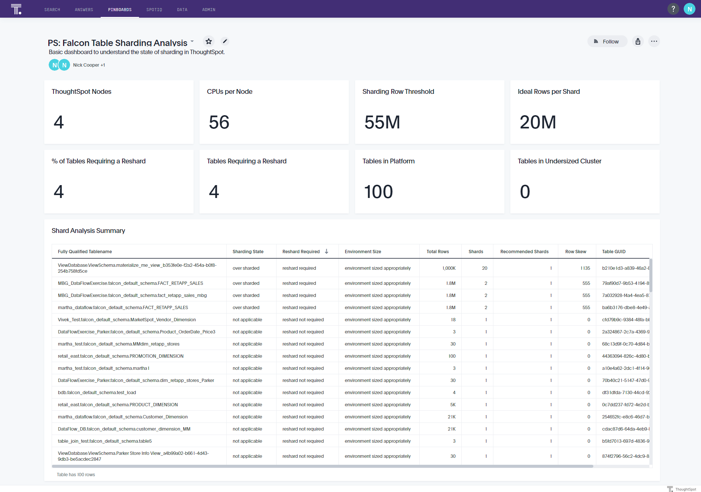

# Sharding Recommender

***This tool utilizes private API calls.***

This solution allows the customer to extract key data about their Falcon tables to help
guide on the optimal number of shards for each table. Ideally, the customer will
implement this solution to run on a regular basis, with a plan to review the pinboard
once every few months (depending on data volume growth).

**Currently, this solution does not consider co-sharding as part of the output.**

If your customer is not comfortable with sharding, please have them schedule an
Office Hours session and a CSA will be able to help guide them through the process.

## Pinboard preview

<p align="center">
  
</p>


## CLI preview

```console
(.cs_tools) C:\work\thoughtspot\cs_tools>cs_tools tools sharding-recommender --help
Usage: cs_tools tools sharding-recommender [OPTIONS] COMMAND [ARGS]...

  Gather data on your existing Falcon tables for sharding.

  Once tables grow sufficiently large within a Falcon deployment, cluster performance and data loading can be enhanced
  through the use of sharding. The choice of what column to shards and how many shards to use can vary based on many
  factors. This tool helps expose that key information.

  Before sharding, it can be helpful to implement this solution and consult with your ThoughtSpot contact for guidance on
  the best shard key and number of shards to use.

  For further information on sharding, please refer to:
    https://docs.thoughtspot.com/latest/admin/loading/sharding.html

Options:
  --version   Show the tool's version and exit.
  --helpfull  Show the full help message and exit.
  -h, --help  Show this message and exit.

Commands:
  gather        Gather and optionally, insert data into Falcon.
  generate-tml  Create TML files.
```
