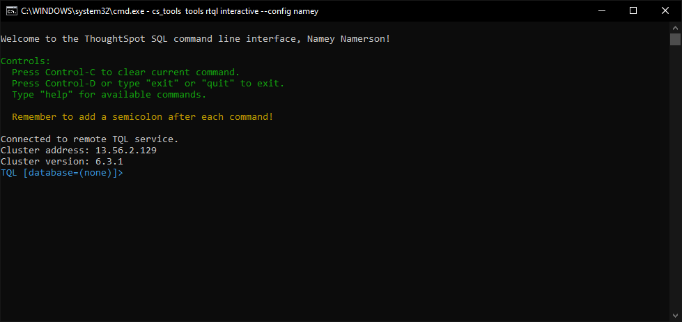

# Remote TQL

This solution allows the customer to interact with the TQL utility from a remote
machine. There are three command for remote TQL:

 - Interactive, get the full TQL experience on your local machine
 - Command, execute a single TQL command
 - File, execute a set of commands

A benefit of using remote TQL is that it encourages and enforces security. If you are
running TQL within the software command line, you are most likely signed in under the
`admin` account. Remote TQL enforces privileges: the logged in user __must__ have at
least the "Can Manage Data" privilege in ThoughtSpot.

## Interactive TQL preview



## CLI preview

=== "rtql --help"
    ```console
    (.cs_tools) C:\work\thoughtspot\cs_tools>cs_tools tools rtql --help
    Usage: cs_tools tools rtql [--version, --help] <command>

      Enable querying the ThoughtSpot TQL CLI from a remote machine.

      TQL is the ThoughtSpot language for entering SQL commands. You can use TQL to view and modify schemas and data in tables.

      For further information on TQL, please refer to:
        https://docs.thoughtspot.com/latest/reference/sql-cli-commands.html
        https://docs.thoughtspot.com/latest/reference/tql-service-api-ref.html

    Options:
      --version               Show the version and exit.
      -h, --help, --helpfull  Show this message and exit.

    Commands:
      command      Run a single TQL command on a remote server.
      file         Run multiple commands within TQL on a remote server.
      interactive  Run an interactive TQL session as if you were on the cluster.
    ```

=== "rtql command"
    ```console
    (.cs_tools) C:\work\thoughtspot\cs_tools>cs_tools tools rtql command --help

    Usage: cs_tools tools rtql command --config IDENTIFIER [--option, ..., --help] [COMMAND]

      Run a single TQL command on a remote server.

      By default, this command will accept input from a pipe.

    Arguments:
      (COMMAND)  TQL query to execute  (default: -)

    Options:
      --schema TEXT           schema name to use  (default: falcon_default_schema)
      --config IDENTIFIER     config file identifier  (required)
      -h, --help, --helpfull  Show this message and exit.
    ```

=== "rtql file"
    ```console
    (.cs_tools) C:\work\thoughtspot\cs_tools>cs_tools tools rtql file --help

    Usage: cs_tools tools rtql file --config IDENTIFIER [--option, ..., --help] FILE.tql

      Run multiple commands within TQL on a remote server.

    Arguments:
      FILE.tql  path to file to execute, default to stdin  (required)

    Options:
      --config IDENTIFIER     config file identifier  (required)
      -h, --help, --helpfull  Show this message and exit.
    ```

=== "rtql interactive"
    ```console
    (.cs_tools) C:\work\thoughtspot\cs_tools>cs_tools tools rtql interactive --help

    Usage: cs_tools tools rtql interactive --config IDENTIFIER [--option, ..., --help]

      Run an interactive TQL session as if you were on the cluster.

      TQL is a command line interface for creating schemas and performing basic database administration.

      For a list of all commands, type "help" after invoking tql

    Options:
      --autocomplete          toggle auto complete feature  (default: True)
      --schema TEXT           schema name to use  (default: falcon_default_schema)
      --debug                 print the entire response to console
      --timeout INTEGER       network call timeout threshold  (default: 5.0)
      --config IDENTIFIER     config file identifier  (required)
      -h, --help, --helpfull  Show this message and exit.
    ```

---

# Changelog

!!! tldr ":octicons-tag-16: v1.0.2 &nbsp; &nbsp; :material-calendar-text: 2021-08-28"

    === ":bug: &nbsp; Bugfix"
        - tqlservice response uncaught error [@boonhapus][contrib-boonhapus]{ target='secondary' .external-link }.

??? info "Changes History"

    ??? tldr ":octicons-tag-16: v1.0.1 &nbsp; &nbsp; :material-calendar-text: 2021-05-24"
        === ":wrench: &nbsp; Modified"
            - Handle `clear` in the Interactive TQL shell [@boonhapus][contrib-boonhapus]{ target='secondary' .external-link }.

    ??? tldr ":octicons-tag-16: v1.0.0 &nbsp; &nbsp; :material-calendar-text: 2021-05-22"
        === ":hammer_and_wrench: &nbsp; Added"
            - Initial release [@boonhapus][contrib-boonhapus]{ target='secondary' .external-link }.

[contrib-boonhapus]: https://github.com/boonhapus
