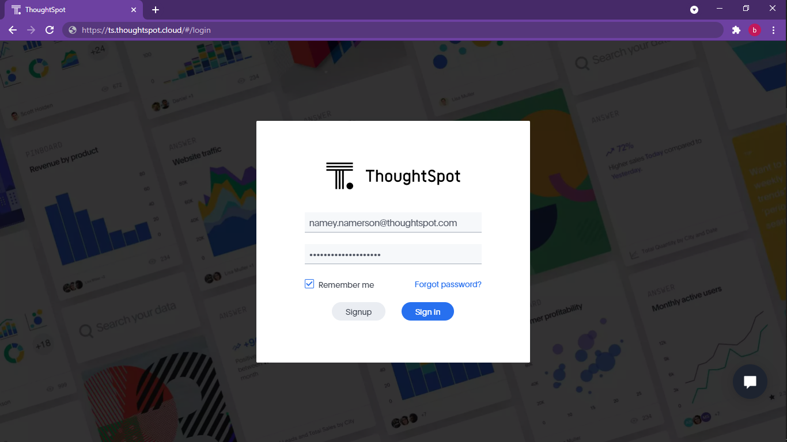

All of the CS Tools will interact with the ThoughtSpot API in some way. For nearly all calls, the API requires a form of authentication.

For example, the details you put into the login screen that's presented when you visit your ThoughtSpot platform are the same you could use for `cs_tools`. This would mean that all actions you perform in `cs_tools`, would look as if you performed them yourself in your web interface.



If you do not supply all the required arguments to properly authenticate to ThoughtSpot, each CS Tool will interactively ask for the remaining ones. To bypass the interactive feature, you can supply the `--config` argument to an already set up configuration.

??? note "Arguments on every CS Tool"

    Since each tool utilizes the API, they all take the following arguments. You can see a listing of these arguments at any time, using the `--helpfull` option.

    === "Required"
        ```
          Name             Type     Description
          --------------------------------------------------------------
          --host        |  TEXT   |  thoughtspot server
          --username    |  TEXT   |  username when logging into ThoughtSpot
          --password    |  TEXT   |  password when logging into ThoughtSpot
        ```

    === "Optional"
        ```
          Name             Type     Description
          --------------------------------------------------------------
          --port        | INTEGER |  optional, port of the thoughtspot server
          --disable_ssl |  FLAG   |  disable SSL verification
          --disable_sso |  FLAG   |  disable automatic SAML redirect
        ```

    === "Recommended"
        ```
          Name             Type     Description
          --------------------------------------------------------------
          --config      |  TEXT   |  config file identifier
        ```

    *If any of these options are supplied in addition to *`--config`*, they override what's set in the configuration.*


## Config File Commands

The top level `cs_tools config` command has a few subcommands. There can be any number of config files saved on your machine. There can also be any number of config files set up against a target instance.

!!! info "`--config / --name`"
    
    For commands that require you to pass the `--config` or `--name` option, the name is simply a unique identifier for a configuration.

=== "config create"

    ```console
    (.cs_tools) C:\work\thoughtspot\cs_tools>cs_tools config create

    Usage: cs_tools config create [OPTIONS]

      Create a new config file.

    Options:
      --name TEXT      config file identifier  (required)
      --host TEXT      thoughtspot server  (required)
      --port INTEGER   optional, port of the thoughtspot server
      --username TEXT  username when logging into ThoughtSpot  (required)
      --password TEXT  password when logging into ThoughtSpot  (required)
      --disable_ssl    disable SSL verification  (default: False)
      --disable_sso    disable automatic SAML redirect  (default: False)
      -h, --help       Show this message and exit.
    ```

=== "config delete"

    ```console
    (.cs_tools) C:\work\thoughtspot\cs_tools>cs_tools config delete

    Usage: cs_tools config delete [OPTIONS]

      Delete a config file.

    Options:
      --name TEXT  config file identifier  (required)
      -h, --help   Show this message and exit.
    ```

=== "config modify"

    ```console
    (.cs_tools) C:\work\thoughtspot\cs_tools>cs_tools config modify --help

    Usage: cs_tools config modify [OPTIONS]

      Modify an existing config file.

    Options:
      --name TEXT      config file identifier  (required)
      --host TEXT      thoughtspot server
      --port INTEGER   optional, port of the thoughtspot server
      --username TEXT  username when logging into ThoughtSpot
      --password TEXT  password when logging into ThoughtSpot
      --disable_ssl    disable SSL verification
      --disable_sso    disable automatic SAML redirect
      -h, --help       Show this message and exit.
    ```

=== "config show"

    ```console
    (.venv) C:\work\thoughtspot\cs_tools>cs_tools config show --help

    Usage: cs_tools config show [OPTIONS]

      Show the location of the currently saved config files.

    Options:
      -h, --help  Show this message and exit.
    ```

## Example Configuration File

You can view all the currently configured environments by using the `cs_tools config show` command and following the directory path shown in your terminal.

??? danger "What happens with my password?"
    
    For security reasons, your password lives obfuscated both in memory and the configuration file upon being captured by `cs_tools`. It is only decrypted once per run, when authorizing with your ThoughtSpot platform.

```toml
[thoughtspot]
host = "https://ts.thoughtspot.cloud"
disable_ssl = false
disable_sso = false

[auth.frontend]
username = "namey.namerson@thoughtspot.com"
password = "aBcDEf1GhIJkLMnOPQRStuVx"
```
