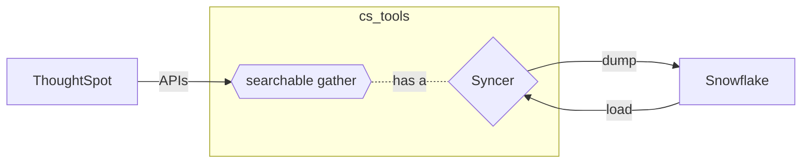

---
hide:
  - toc
---

Syncers allow __CS Tools__ to interact with a data storage layer without having to know
the explicit details of how to do so.

We've implemented syncers to many popular data storage formats.

---

<center>

*data flow diagram between ThoughtSpot and an external data source*
</center>

---

## __How do I use Syncers?__ { .fc-blue }

In order to interact with your external data source, users are required to supply either a `definition.toml` file or
type out all the parameters on the command line.

For example if you are to use the Excel syncer, you might have to specify a filepath to the target workbook. On the
other hand if you use the Database syncer, you could be asked to provide database connection or authentication details.


__Each Syncer has different requirements__ and should document them clearly.

!!! info "some examples of `DEFINITION.toml`"
    This is a file which tells your Syncer how to behave. Think of the `DEFINITION.toml` as a mini configuration file.

    === ":fontawesome-solid-file-csv: CSV"
        ```toml
        [configuration]
        directory = '...'
        delimiter = '|'
        escape_character = '\'
        save_strategy = APPEND
        ```

    === ":material-database: SQLite"
        ```toml
        [configuration]
        database_path = '...'
        load_strategy = 'truncate'
        ```

    === ":material-google-spreadsheet: Google Sheets"
        ```toml
        [configuration]
        spreadsheet = data
        credentials_file = data-6538a3a8f574.json
        save_strategy = APPEND
        ```

    === ":fontawesome-solid-snowflake: Snowflake"
        ```toml
        [configuration]
        account_name = '...'
        username = '...'
        secret = '...'
        warehouse = 'WH_DATA_LOADS_XS'
        role = 'DATA_OPERATIONS'
        database = 'GO_TO_MARKET'
        schema = 'CS_TOOLS'
        authentication = 'basic'
        load_strategy = 'truncate'
        ```

Once you have have a definition file, you can supply it to any `cs_tools `command which
documents that it interfaces with Syncers. The syntax for this looks like..

   ```console
   cs_tools tools searchable bi-server --syncer gsheets:///home/user/syncers/data-sink.toml --compact
   ```

Where the __`gsheets://`__ portion tells CS Tools which Syncer to use, and the
__`/home/user/syncers/data-sink.toml`__ is the full path to your `definition.toml` file.

*If your data format is not yet implemented, read on to the next page to learn about the
syncer protocol and be able to write your own custom syncer.*


[gh-issue25]: https://github.com/thoughtspot/cs_tools/issues/25
