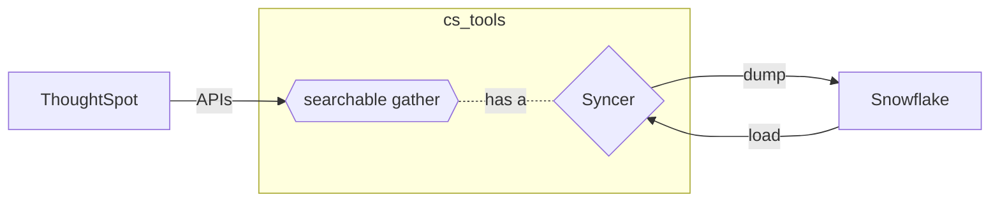

---
hide:
  - toc
---

Syncers allow __CS Tools__ to interact with a data storage layer without having to know
the explicit details of how to do so. We've implemented syncers to many popular data
storage formats.

!!! attention "In Beta"

    The Syncer protocol is in beta, it has been added to __CS Tools__ in v1.3 on a
    __provisional basis__. It may change significantly in future releases and its
    interface will not be concrete until v2.

    Feedback from the community while it's still provisional would be extremely useful;
    either comment on [#25][gh-issue25] or create a new issue.

---

<center>

*data flow diagram between ThoughtSpot and an external data source*
</center>

---

## __How do I use Syncers?__ { .fc-blue }

In order to interact with your external data source, users are required to supply a `definition.toml` file. This is a
file which tells your Syncer how to behave.

For example if you are to use the Excel syncer, you might specify a filepath to the target workbook. On the other hand
if you use the Database syncer, you could be asked to provide database connection or authentication details.

__Each Syncer has different requirements__ and should document them clearly. Think of the `DEFINITION.toml` as a mini
configuration file.

!!! info "some examples of `DEFINITION.toml`"

    === ":fontawesome-solid-file-csv: CSV"
        ```toml
        [configuration]
        directory: 'C:\Users\NameyNamerson\Downloads\thoughtspot'
        delimiter: str = '|'
        escape_character: str = '\'
        line_terminator: str = '\r\n'
        zipped: bool = True
        ```

    === ":material-database: SQLite"
        ```toml
        [configuration]
        database_path = '/home/user/ts-data/production.db'
        truncate_on_load = True
        ```

    === ":material-google-spreadsheet: Google Sheets"
        ```toml
        [configuration]
        spreadsheet = 'ThoughtSpot Data Sink'
        mode = 'overwrite'
        credentials_file = '/home/.config/cs_tools/gsheets/credentials.json'
        ```

    === ":fontawesome-solid-snowflake: Snowflake"
        ```toml
        [configuration]
        lorem ipsum bruh
        ```

    === ":material-new-box: Custom Syncer"
        ```toml
        manifest = '/home/user/syncers/foo-syncer/MANIFEST.json'

        [configuration]
        ...
        ```
        __custom syncers are an advanced feature!__{ .fc-coral } users must supply both
        the path to the MANIFEST.json and the configuration all at once*

Once you have have a definition file, you can supply it to any cs_tool command which
documents that it interfaces with Syncers. The syntax for this looks like..

   ```console
   cs_tools tools searchable bi-server gsheets:///home/user/syncers/data-sink.toml --compact
   ```

Where the __`gsheets://`__ portion tells CS Tools which Syncer to use, and the
__`/home/user/syncers/data-sink.toml`__ is the full path to your `definition.toml` file.

*If your data format is not yet implemented, read on to the next page to learn about the
syncer protocol and be able to write your own custom syncer.*


[gh-issue25]: https://github.com/thoughtspot/cs_tools/issues/25
