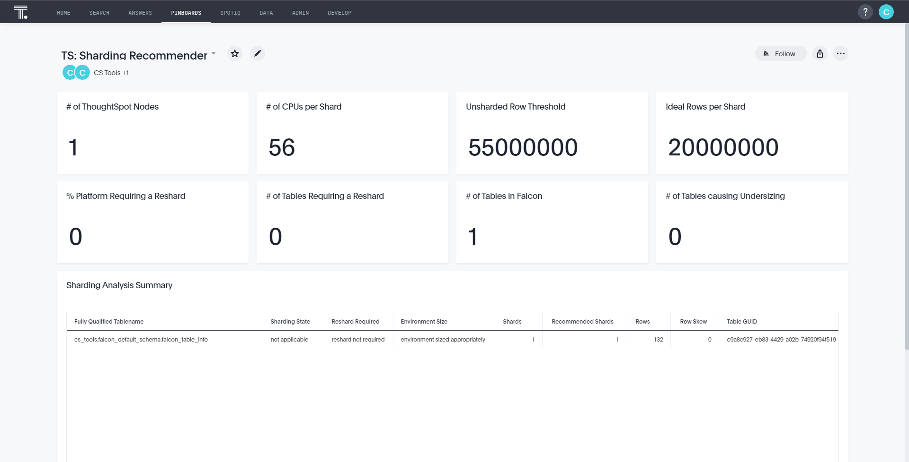

---
hide:
    - toc
---

# Falcon Sharding

This solution allows you to extract key data about Falcon tables to help guide on the
optimal number of shards for each table. Ideally, once implemented, you will run it on a
regular basis, with a plan to review the liveboard once every few months (depending on 
data volume growth).

__Currently, this solution does not consider co-sharding as part of the output.__{ .fc-coral }

If you are not comfortable with the sharding, or want to learn more about what benefit
sharding brings you, please reach out to your __Solutions Consultant__ and we'll
help guide you through the process.

## Liveboard preview

## CLI preview

=== "falcon-sharding --help"
    ~cs~tools ../.. cs_tools tools falcon-sharding --help

=== "sharding-recommender gather"
    ~cs~tools ../.. cs_tools tools falcon-sharding gather --help

=== "sharding-recommender deploy"
    ~cs~tools ../.. cs_tools tools falcon-sharding deploy --help

---

## Changelog

!!! tldr ":octicons-tag-16: v1.2.0 &nbsp; &nbsp; :material-calendar-text: 2022-04-28"

    === ":hammer_and_wrench: &nbsp; Added"
        - SpotApp parameters, customize the spot app to your specific ThoughtSpot instance

    === ":wrench: &nbsp; Modified"
        - input/output using syncers! [@boonhapus][contrib-boonhapus]{ target='secondary' .external-link }.

??? info "Changes History"

    ??? tldr ":octicons-tag-16: v1.1.2 &nbsp; &nbsp; :material-calendar-text: 2021-11-09"
        === ":wrench: &nbsp; Modified"
            - `--save_path` is now `--export` [@boonhapus][contrib-boonhapus]{ target='secondary' .external-link }.
            - `tml` is now `spotapp` [@boonhapus][contrib-boonhapus]{ target='secondary' .external-link }.

    ??? tldr ":octicons-tag-16: v1.1.1 &nbsp; &nbsp; :material-calendar-text: 2021-09-11"
        === ":wrench: &nbsp; Modified"
            - support for large clusters with API call batching [@boonhapus][contrib-boonhapus]{ target='secondary' .external-link }.

    ??? tldr ":octicons-tag-16: v1.0.1 &nbsp; &nbsp; :material-calendar-text: 2021-05-22"
        === ":wrench: &nbsp; Modified"
            - Migrated to new app structure [@boonhapus][contrib-boonhapus]{ target='secondary' .external-link }.

    ??? tldr ":octicons-tag-16: v1.0.0 &nbsp; &nbsp; :material-calendar-text: 2020-08-18"
        === ":hammer_and_wrench: &nbsp; Added"
            - Initial release [@boonhapus][contrib-boonhapus]{ target='secondary' .external-link }.

[office-hours]: https://thoughtspotcs-officehours.youcanbook.me/
[contrib-boonhapus]: https://github.com/boonhapus
