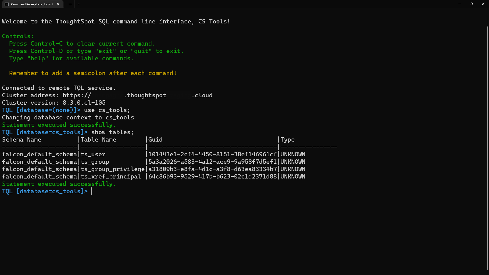

---
hide:
    - toc
---

# Remote TQL

This solution allows you to interact with the TQL utility from a remote machine. There
are three command for remote TQL:

 - Interactive, get the full TQL experience on your local machine
 - Command, execute a single TQL command
 - File, execute a set of commands

??? info "Remote TQL enforces privileges"

    You __must__ have at least the __`Can Manage Data`__ privilege
    in ThoughtSpot to use this tool.

    If you are running `TQL` within on the backend command line, you are most likely
    signed in under the `admin` account. __CS Tools__ enhances this security by
    enforcing privileges based on what user is logged in.

## Interactive TQL preview

## CLI preview

=== "rtql --help"
    ~cs~tools ../.. cs_tools tools rtql --help

=== "rtql command"
    ~cs~tools ../.. cs_tools tools rtql command --help

=== "rtql file"
    ~cs~tools ../.. cs_tools tools rtql file --help

=== "rtql interactive"
    ~cs~tools ../.. cs_tools tools rtql interactive --help

---

# Changelog

!!! tldr ":octicons-tag-16: v1.0.2 &nbsp; &nbsp; :material-calendar-text: 2021-08-28"

    === ":bug: &nbsp; Bugfix"
        - tqlservice response uncaught error [@boonhapus][contrib-boonhapus]{ target='secondary' .external-link }.

??? info "Changes History"

    ??? tldr ":octicons-tag-16: v1.0.1 &nbsp; &nbsp; :material-calendar-text: 2021-05-24"
        === ":wrench: &nbsp; Modified"
            - Handle `clear` in the Interactive TQL shell [@boonhapus][contrib-boonhapus]{ target='secondary' .external-link }.

    ??? tldr ":octicons-tag-16: v1.0.0 &nbsp; &nbsp; :material-calendar-text: 2021-05-22"
        === ":hammer_and_wrench: &nbsp; Added"
            - Initial release [@boonhapus][contrib-boonhapus]{ target='secondary' .external-link }.

[contrib-boonhapus]: https://github.com/boonhapus
