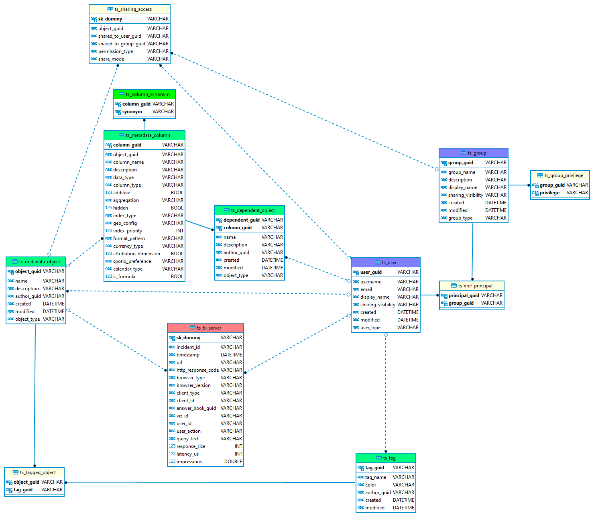

---
hide:
    - toc
---

# Searchable Content

As your platform grows, it can oftentimes be useful to keep track of how much content
is created within the system. For example, tracking the amount of answers or liveboards
created over time can help you understand how your Users interact with __ThoughtSpot__.

Another use case might be to set up a liveboard gating conditions based on when or how
often a user uploads data (eg. a combination of metadata type of "imported data", the 
metadata object's modified/created time and the __ThoughtSpot__ datetime function
`today()`). This could give you early warning when a user is missing a dataset that could
provide value to others in your platform.

??? info "__ThoughtSpot__ Data Model"

    <figure markdown>
      
      <figcaption>__full schema diagram for the searchable ThoughtSpot metadata__</figcaption>
    </figure>
    

## CLI preview

=== "searchable --help"
    ~cs~tools tools searchable --help

=== "searchable metadata"
    ~cs~tools tools searchable metadata --help

=== "searchable bi-server"
    ~cs~tools tools searchable bi-server --help

=== "searchable audit-logs"
    ~cs~tools tools searchable audit-logs --help

=== "searchable deploy"
    ~cs~tools tools searchable deploy --help

[contrib-boonhapus]: https://github.com/boonhapus
