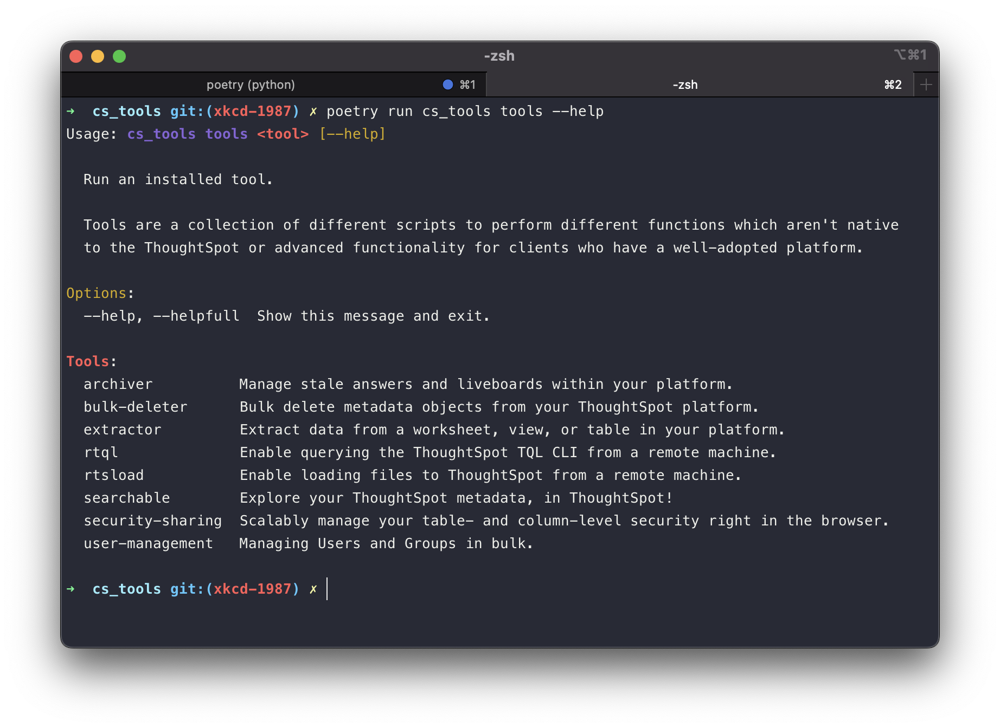
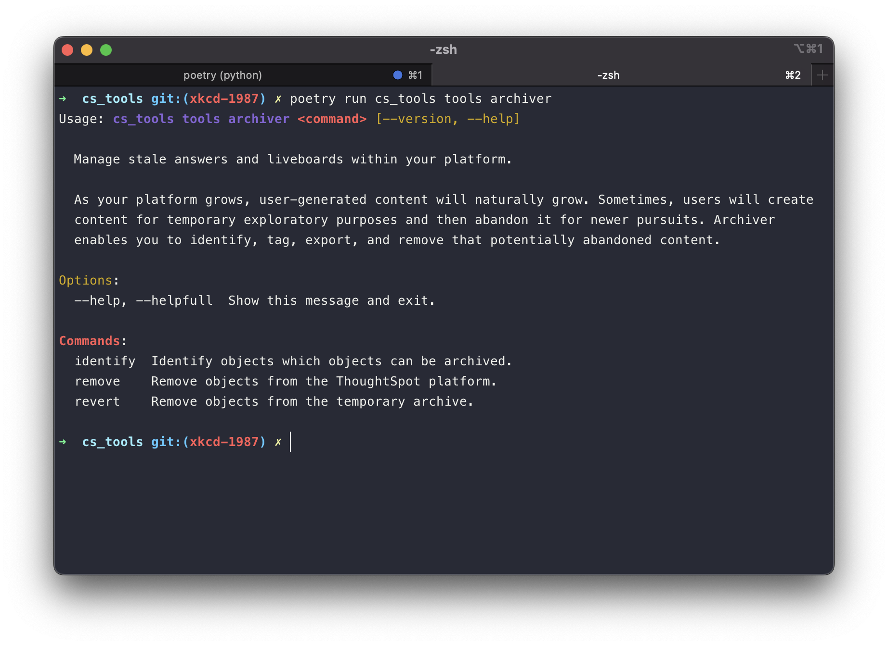
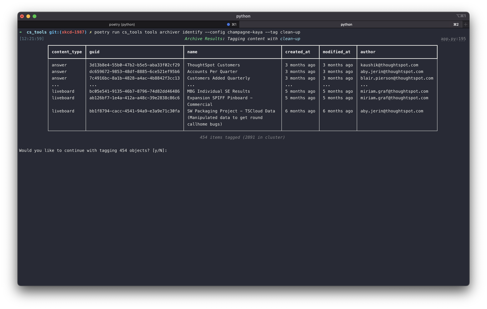

<style>
  /* Hide the "Edit on Github" button */
  .md-content__button { display: none; }
</style>

# Running the Tools

Now that we've configured our environment, let's explore the tools!

You can find all of the tools by either visiting the [documentation][cs-tools-docs]{ target='secondary' } or typing...

<figure markdown>
  <figcaption>cs_tools tools --help</figcaption>
  
</figure>


## Archiver: Maintaining metadata

__Archiver__{ .fc-purple } is a tool that helps you find and clean up stale answers and liveboards in your
__ThoughtSpot__ platform.

As the number of users grow, so does the content that they create. Even though no data from your data sources are stored
within __ThoughtSpot__, maintaining unused references to this content still requires resources. Additionally, excess
metadata can slow down the backup, restore, and cluster upgrades processes.

Let's look at the commands you get with the __Archiver__{ .fc-purple } tool.

=== "identify"
    Compare recently active content (Answers and Liveboards) against all of the created content in your platform.

    `--tag`
    The name of the __ThoughtSpot__ sticker to attach to inactive content. If this tag doesn't exist, we'll create it.

    `--recent-activity, --recent-modified`
    The number of days to consider for content recently viewed, created, or saved -- don't mark it for archival.

    `--ignore-tag`
    Filter out content which has been tagged with this name.

=== "revert"
    Remove a specific `--tag` from all content.

=== "remove"
    Remove all content with a specific tag.

    `--tag`
    The name of the __ThoughtSpot__ sticker which identifies inactive content.

    `--export-tml`
    The full path to export content which has been marked for deletion.

    `--export-only`
    If specified, __do not delete the content__, only exports as a zip file.

<figure markdown>
  <figcaption>cs_tools tools archiver --help</figcaption>
  
</figure>

From the available commands, we can come up with an administrative process to help maintain a clean environment. You
can use the below framework with __Archiver__{ .fc-purple}.

=== "1. Identify stale content"
    Run __Archiver__{ .fc-purple } `identify` to isolate inactive content.

    Label the tag name as `clean-up`.

=== "2. Inform your __ThoughtSpot__ User community"
    Communicate to your __ThoughtSpot__ User community that the admin team will be performing a cleanup activity.

    In an effort to keep the __ThoughtSpot__ cluster running smoothly, Answers and Liveboard which have not been
    viewed in over <span class=fc-blue>--recent-activity days</span> will be marked for deletion.

    If Users wish to keep their content, they may go and remove the `clean-up` tag.

=== "3. Maintain a deprecration cycle"
    Wait a minimum of one week before performing any cleanup actions.

    Maintain an active dialogue with your User community during this time, in case they have questions or concerns.

=== "4. Purge your cluster of stale content"
    Run __Archiver__{ .fc-purple } `remove`, targeting the tag name `clean-up`.

    __Strongly consider__{ .fc-coral } using the `--export-tml` so you can restore any content that users wish they had
    saved during the deprecation cycle.


## Try it out

Let's run the command to identify all content which hasn't been viewed within the past 3 months or created in the last 4
months. We'll use the tag `clean-up` to communicate to our Users that this content is targeted for removal.

We'll also ignore all of our __Training__ content, since we haven't run a new user onboarding this quarter, and our
__Certified__ datasets, even though it's unlikely that this content hasn't been viewed in the past 90 days.. but it's
better to be safe than sorry!

```console
cs_tools tools archiver identify
--config non-prod
--tag clean-up
--recent-activity 90
--recent-modified 120
--ignore-tag certified
--ignore-tag training
```

??? info "Using --config"
    Since we set our `non-prod` configuration as the default, usage of `--config non-prod` is optional here.
    __CS Tools__ will attempt to use the default configuration first, but if we wanted to run __Archiver__{ .fc-purple }
    against another cluster (eg. Production), we can override it with the `--config` option.

<figure markdown>
  <figcaption>cs_tools tools archiver identify ...</figcaption>
  
</figure>

!!! danger "__Administrative Responsibility__"

    __The maintainers of CS Tools recognize when we give you lots of power.__{ .fc-coral }

    For this reason, with tools that perform bulk management, it's important to have fail-safes before executing the
    commands. With __Archiver__{ .fc-purple }, you'll be prompted to continue with your operation before affecting
    potentially hundreds of Users.


## Report on Archiver operations

In highly active __ThoughtSpot__ deployments, the identification process can find more content than the admin team is
comfortable interacting with directly in the web user-interace.

On all three __Archiver__{ .fc-purple } commands, you'll find a `--report` option which labels information about the
type of content that we'll tag or remove, as well as who owns it. This information can be incredibly helpful to inspect
and even help you communicate with those Users directly.

__In the next section__, we'll learn about __Syncers__{ .fc-blue } and how you can leverage them to manage all the
information that __Archiver__{ .fc-purple } produces.


[cs-tools-docs]: https://thoughtspot.github.io/cs_tools/cs-tools/overview/