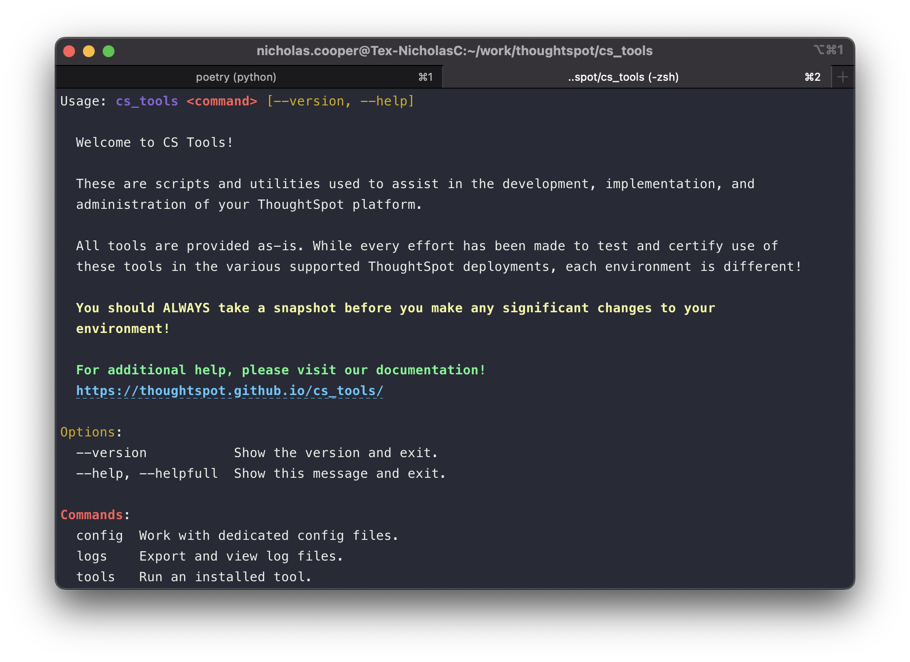

<style>
  /* Hide the "Edit on Github" button and paragraph header link */
  .md-content__button { display: none; }
  .md-typeset .headerlink { display: none; }
</style>

# Installation & Upgrading the Tools

__CS Tools__ is a command line application written in :fontawesome-brands-python: __Python__.

__The minimum supported version of Python is 3.6.8__{ .fc-coral }
<br/><sup>any newer version of Python is fine too</sup>

Click the __blue button__{ .fc-blue } below to fill out the Google Form[^1] and get access to the __CS Tools__ installer.

<center><sub>
:point_down: What's this? Whenever you see one of these colorful blocks, click on it for more information! :point_down:
</sub></center>

??? warning "Don't have Python installed yet?"

    __Python 3.6.8 or greater is required__{ .fc-coral } to install and operate __CS Tools__!

    === ":fontawesome-brands-windows: Windows"
        If you've never worked directly with Python before, chances are it is not installed on your computer.

        In Powershell, try typing `python --version`. In order for __CS Tools__ to run appropriately, this version must
        be greater than the __requirement__{ .fc-coral } above.

        If you do not have python installed, or your version of python is not greater than the above version, you can
        install it by going to Python's [downloads website][python].

        __Make sure you check Customize Installation and add Python to your `PATH`__.

    === ":fontawesome-brands-apple: Mac"
        More than likely, you have multiple versions of Python bundled with your distribution.

        In Terminal, try typing `python --version`. If it comes back with something like `Python 2.7.18` then try again
        with `python3 --version`. In order for __CS Tools__ to run appropriately, this version must be greater than the
        __requirement__{ .fc-coral } above.

        If your version of python is not greater than the above version, you can install it by going to Python's
        [downloads website][python].

    === ":fontawesome-brands-linux: Linux"
        More than likely, you have multiple versions of Python bundled with your distribution.

        Try typing `python --version`. If it comes back with something like `Python 2.7.18` then try again with
        `python3 --version`. In order for __CS Tools__ to run appropriately, this version must be greater than the
        __requirement__{ .fc-coral } above.

        If your version of python is not greater than the above version, __you should consult with your system
        administration team__ to understand if it's acceptable to install multiple versions of python on this hardware.

        An alternative for installing multiple system-level python distributions could be [`pyenv`][pyenv].

    === ":fontawesome-brands-centos: ThoughtSpot cluster"
        Python is already installed here! You should be good to go.


<center>
[:material-tools: &nbsp; get the tools &nbsp;][google-form-install]{ target='secondary' .md-button .md-button--primary }
</center>

---

## After Downloading

The __CS Tools__ bootstrapper will install or upgrade your isolated environment. If your target machine doesn't have
internet, the bootstrapper also contains all the dependencies necessary to build the environment.

Follow the steps below to get __CS Tools__ installed on your platform.

=== ":fontawesome-brands-windows: Windows"

    Open up __Windows Terminal__ or __Powershell__.

    ```powershell
    # Navigate to the Downloads directory
    cd $env:USERPROFILE/Downloads

    # Unzip the CS Tools bootstrapper
    Remove-Item -Recurse -Force cs_tools-boot* -ErrorAction Ignore
    Expand-Archive windows-cs_tools-* -DestinationPath cs_tools-bootstrapper

    # Navigate into the unzipped directory
    cd cs_tools-bootstrapper

    # Run the help command to see the CLI
    python bootstrap -h

    # Run the installer
    python bootstrap --reinstall
    ```

=== ":fontawesome-brands-apple: :fontawesome-brands-linux: Mac, Linux"

    Open up a new __Terminal__ window.

    ```bash
    # Navigate to the Downloads directory
    cd $HOME/Downloads

    # Unzip the CS Tools bootstrapper
    rm -r cs_tools-boot*
    unzip *-cs_tools-* -d cs_tools-bootstrapper

    # Navigate into the unzipped directory
    cd cs_tools-bootstrapper

    # Run the help command to see the CLI
    python bootstrap -h

    # Run the installer
    python bootstrap --reinstall
    ```

    ??? fail "command not found: python"

        If you see this error in your terminal, try using `python3` instead of `python` above.

=== ":fontawesome-brands-centos: ThoughtSpot cluster"
    
    __We strongly recommend against this option.__{ .fc-coral } __CS Tools__ should ideally run from another machine.

    ```bash
    # Navigate to the Downloads directory
    cd $HOME/Downloads

    # Unzip the CS Tools bootstrapper
    rm -r cs_tools-boot*
    unzip *-cs_tools-* -d cs_tools-bootstrapper

    # Navigate into the unzipped directory
    cd cs_tools-bootstrapper

    # Run the help command to see the CLI
    python bootstrap -h

    # Run the installer
    python bootstrap --reinstall
    ```

    ??? fail "I get a REALLY noisy error about locales!"

        By default, some __ThoughtSpot__ Software builds limit the Python environment to where it thinks you are
        restricted to ASCII data. The solution to this problem is to export your locale prior to executing __CS Tools__.

        ```
        export LC_ALL=C.UTF-8
        export LANG=C.UTF-8
        ```

        The bootstrapper adds locale data to your shell profiles. Run `exec $SHELL` to reload the profile and capture
        this information.


Try running __CS Tools__ by typing..

<center>*cs_tools* &#8203 &#8203 ++return++</center>

If it doesn't look like the image below, try restarting your terminal first.




<center>
## A note on __Getting Help__{ .fc-mint }

__CS Tools__ exists ^^totally separate^^ from your __ThoughtSpot__ cluster.

The project is maintained by our Professional Services and Customer Success teams as well as by contributions from you,
our customers!

==__You cannot raise a support ticket in order to get the proper help.__==

If you run into issues at any time, either reach out to your assigned Customer Success Manager, or submit feedback to
the __CS Tools__ team directly in this [Google Form][google-form-help], or open an [issue on GitHub][github-help].
</center>

---

## Configure CS Tools

__CS Tools__ supports being run against many different platforms. Configuration files represent a way to define a
specific user interacting with ThoughtSpot programmatically.

This can be helpful if you maintain both a __Production__ and __Non-Production__ environment, or if you operate as a
center of excellence and want to provide your domain managers with programmatic access to the portion of
__ThoughtSpot__.

__Read on to the next section__ to learn about how to set up a configuration file.


[^1]:

    We use the survey responses as a feedback loop into the __ThoughtSpot__ Product team. To add extra emphasis to that
    feedback loop, you can find or submit your idea to the [__Product Ideas section__][kb-product-ideas] in ThoughtSpot
    Community.

[kb-product-ideas]: https://community.thoughtspot.com/s/article/Guide-to-ThoughtSpot-Product-Ideas
[google-form-install]: https://forms.gle/fNQpF3ubkjQySGo66
[google-form-help]: https://forms.gle/Tmbs6ZhsZa2DMFsU9
[github-help]: https://github.com/thoughtspot/cs_tools/issues/new/choose
[pyenv]: https://github.com/pyenv/pyenv
[python]: https://www.python.org/downloads/
