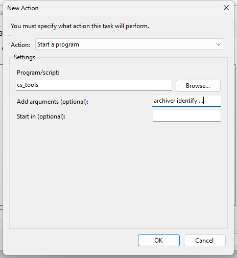

---
hide:
    - toc
    - footer
---

# Scheduling with __CS Tools__

__Archiver__{ .fc-purple } is a powerful tool in your arsenal as a __ThoughtSpot__ administrator and in order to take
full advantage of it, you'll want to schedule it to run regularly.

It can be helpful to keep close tabs on the amount of stale content that exists in your platform. Let's schedule our
__Archiver__{ .fc-purple } identification report to export from the platform once every week.

!!! tip "CS Tools"

    Since __CS Tools__ lives on your `PATH`, even though the code exists in an isolated environment, the entrypoint can
    be reached anywhere on your system.


## Schedule it

Now that we've decided how to track our content, we're ready to schedule our command to run weekly.

=== ":fontawesome-brands-windows: Task Scheduler"

    Find the Task Scheduler in your system utilities.

    === "Create a New Task."
        

    === "Weekly Recurring Trigger."
        

    === "Targeting `cs_tools`."
        

=== ":fontawesome-brands-apple: :fontawesome-brands-linux: :fontawesome-brands-centos: crontab"

    !!! hint "Need help?"

        [https://crontab.guru][cronguru]

        *A helpful online utility for writing your cron schedule expressions.*
    
    <sub class=fc-blue>Find the copy button :material-content-copy: to the right of the code block.</sub>
    ```cron
    # Weekly, on Monday at 3:05am
     5  3  *  *  1  cs_tools tools archiver identify --syncer csv://directory=$HOME/Downloads --config non-prod
    ```


## Closing Thoughts

And that's it! Now you have all the tools (pun fully intended :wink:) you need to be able to get up and running with the
__CS Tools__ project. Be sure to check out the rest of the documentation, and also find us on __ThoughtSpot Community__.

<div class=grid-even-columns data-columns=4 markdown="block">
[:octicons-tools-16: All the Tools](/tools){ .md-button }

[:octicons-comment-discussion-16: Chat with us](https://github.com/thoughtspot/cs_tools/discussions/55){ .md-button }

[:octicons-bug-16: Report a bug](https://github.com/thoughtspot/cs_tools/issues/new/choose){ .md-button }

[:octicons-mark-github-16: Source code](https://github.com/thoughtspot/cs_tools){ .md-button }
</div>


[cronguru]: https://crontab.guru/
[schtasks]: https://docs.microsoft.com/en-us/previous-versions/orphan-topics/ws.10/cc772785(v=ws.10)?redirectedfrom=MSDN
[github-help]: https://github.com/thoughtspot/cs_tools/issues/new/choose
[search-cs_tools]: https://community.thoughtspot.com/s/global-search/cs_tools
