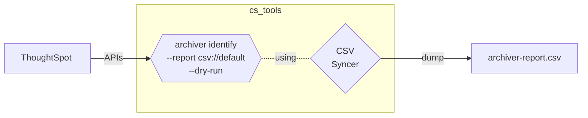

<style>
  /* Hide the "Edit on Github" button */
  .md-content__button { display: none; }

  /* Make better use of whitespace for supported syncers */
  .admonition.tip > ul { columns: 3; }
</style>

# Learn about Syncers

__Syncers__{ .fc-blue } allow __CS Tools__ to interact with popular data storage formats without having to know the
details of how to do so. Think of it as a way to plug and play different places to store your data.

We'll define for __CS Tools__ which data storage we're using, and then pass that along with the rest of our command.

!!! tip "Formats that __CS Tools__ currently supports"

    - CSV
    - SQLite
    - __ThoughtSpot__ Falcon
    - Snowflake
    - Google BigQuery
    - Google Sheets

??? question "Don't see your favorite data format above?"

    __This is for highly advanced users!__{ .fc-coral }

    __Syncers__ follow a documented protocol, if you're savvy with coding in Python, visit the
    [__Syncer Protocol__][syncer-protocol] documentation page and learn about how you can write and supply your own
    custom syncer.

---

With __Archiver__{ .fc-purple }, we can supply a __Syncer__{ .fc-blue } by passing the `--report` option.

Along with the `--dry-run` option, this will allow to inspect the Answers and Liveboards that would be marked for
deletion, all without ever affecting the platform we're targeting.

<center>

</center>

---

## Set up the CSV Syncer

To keep things simple, let's define a definition file for the CSV Syncer. This will allow us to export data that various
tools produce directly to a file. You can find all the configuration settings for syncers in [their section of the
docuemtnation][syncer-csv].

The CSV syncer is simple, all that's __required__{ .fc-coral } is the directory location to export data to. Follow the
instructions below to create a new CSV syncer.

Execute the following command in your terminal. This will create a new __report.toml__{ .fc-blue } file in your Downloads
folder.

=== ":fontawesome-brands-windows: Windows"

    ```powershell
    (
      echo [configuration]
      echo directory = "%USERPROFILE%\Downloads"
    ) > %USERPROFILE%\Downloads\report.toml
    ```

=== ":fontawesome-brands-apple: :fontawesome-brands-linux: Mac, Linux"

    ```bash
    echo "[configuration]" >> $HOME/Downloads/report.toml
    echo "directory = \"$HOME/Downloads\"" >> $HOME/Downloads/report.toml
    ```

??? info "Full CSV Syncer definition example"

    ```toml
    # This is the top-level directive, it is required.
    [configuration]

    # The location to write CSVs to.
    directory = "/path/to/my/folder/"
    
    # Control what character is used to delimit values, CSV stands for
    # "commas separated values" but this parameter allows us to use
    # whatever character we want.
    delimiter = '|'
    
    # Control what character is used to escape reserved characters.
    escape_character = '\'
    
    # Whether to turn the DIRECTORY above into a zip file, or leave
    # exported data as CSV.
    zipped = true
    ```


## Specifying the Syncer

We've created a way for __CS Tools__ to export data to CSV, but how do we use it? Remember, __Archiver__{ .fc-purple }
has an option called `--report protocol://DEFINITION.toml`.

All __Syncers__{ .fc-blue } in __CS Tools__ follow a standard format, called a protocol. Additionally, each
__Syncer__{ .fc-blue } can be customized using their own set of parameters. For example, a __CSV Syncer__ and a
__Snowflake Syncer__ require different setup information to be used.

Whenever you need to specify a __Syncer__{ .fc-blue }, you'll do so by providing the __protocol name__ followed by the
__location of your syncer definition file__, separated by the three characters `://`. This is identical to the
components that make up many common URI syntax like `https://`, `ftp://`, and `mailto://`.

Examples of the __Syncer__{ .fc-blue } protocol URI syntax, all pointing to the same location. The contents of this file
should be changed based on what __Syncer__{ .fc-blue } you want to use.

  - `csv://$HOME/Downloads/report.toml`
  - `snowflake://$HOME/Downloads/report.toml`
  - `sqlite://$HOME/Downloads/report.toml`
  - `gsheets://$HOME/Downloads/report.toml`

You can find the full details for each __Syncer__{ .fc-blue } definition, as well as their protocol name in our
[documentation][syncer-all]{ target='secondary' }.


## Default Syncer

Typing the full protocol out to the __Syncer__{ .fc-blue } definition file can sometimes be difficult. For this reason,
you can add a default for each type of protocol to your __CS Tools__ config file.

Let's set the CSV Syncer we created earlier to be the default for our current configuration.

=== ":fontawesome-brands-windows: Windows"

    ```powershell
    cs_tools config modify --config non-prod --syncer csv://$USERPROFILE%\Downloads\report.toml
    ```

=== ":fontawesome-brands-apple: :fontawesome-brands-linux: Mac, Linux"

    ```bash
    cs_tools config modify --config non-prod --syncer csv://$HOME/Downloads/report.toml
    ```

After we successfully modify our `non-prod` config, we can then specify the CSV syncer using the following syntax
`csv://default`.

!!! tip

    Since __Syncer__{ .fc-blue } definitions are just files, they can be referenced across multiple configurations or
    even stored in a centrally located directory and be leveraged by multiple users interacting with __CS Tools__.


## Try it out

Now that we've learned everything about how to use our CSV Syncer, let's try the command from the diagram above.

```
cs_tools tools archiver identify
--report csv://default
--dry-run
```

If we look at the contents of the file we defined in our CSV syncer, we'll find details about all the content that will
be tagged and identified as inactive.

| content_type | guid        | name         | created_at   | modified_at  | author              | operation |
| ------------ | ----------- | ------------ | ------------ | ------------ | ------------------- | --------- |
| answer       | 3d13b8e4-.. | ThoughtSpo.. | 3 months ago | 3 months ago | abc@thoughtspot.com | identify  |
| answer       | dc659672-.. | Accounts P.. | 3 months ago | 3 months ago | def@thoughtspot.com | identify  |
| answer       | 7c4916bc-.. | Customers .. | 3 months ago | 3 months ago | ghi@thoughtspot.com | identify  |
| answer       | cc623165-.. | Cohort Ans.. | 3 months ago | 3 months ago | jkl@thoughtspot.com | identify  |
| ...          | ...         | ...          | ...          | ...          | ...                 | ...       |


## Define a governance process

Now that we've got the tools to be able to maintain a clean __ThoughtSpot__ platform as it grows, it's an excellent idea
to regularly visit the state of metadata in our cluster.

__In the final section__, we'll explore ways to schedule the tools on both Windows and Unix platforms.


[syncer-protocol]: ../syncer/protocol.md
[syncer-all]: ../syncer/what-is.md
[syncer-csv]: ../syncer/csv.md
